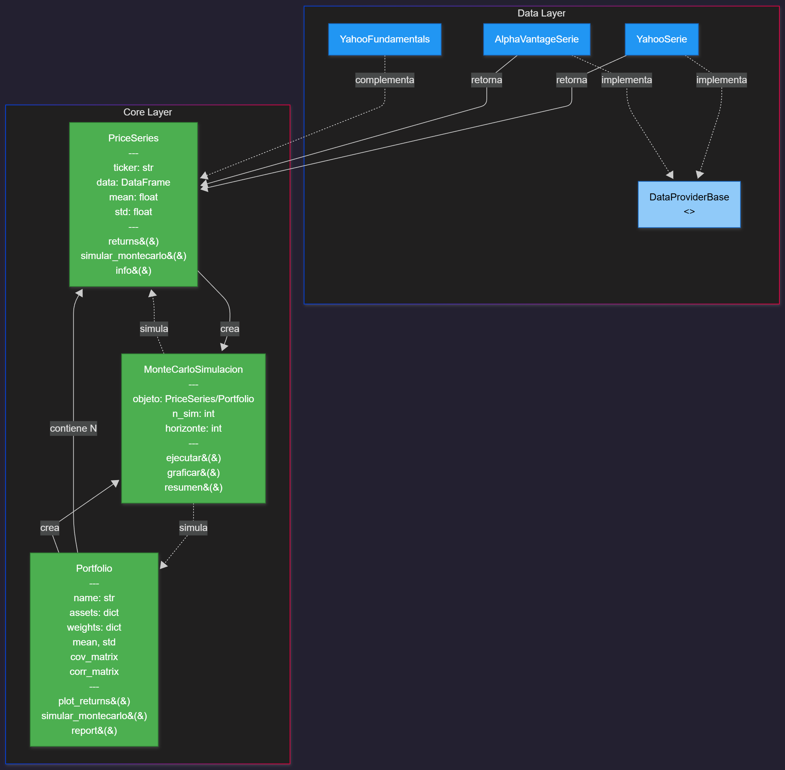

# 📊 Toolkit de Análisis Bursátil

Un conjunto de herramientas en Python para el análisis cuantitativo de mercados financieros, gestión de portafolios y simulaciones de Monte Carlo.



## 📋 Descripción

Este proyecto proporciona un **framework modular y orientado a objetos** para realizar análisis financiero profesional. Combina la descarga de datos desde múltiples fuentes (Yahoo Finance, Alpha Vantage), el cálculo de métricas estadísticas, la gestión de portafolios multi-activo y simulaciones estocásticas mediante el método de Monte Carlo.

### 🎯 Objetivos del Proyecto

- **Abstracción de fuentes de datos**: Interfaz unificada para obtener series de precios desde diferentes APIs financieras
- **Análisis de activos individuales**: Cálculo de retornos, volatilidad y visualizaciones
- **Gestión de portafolios**: Construcción de carteras multi-activo con análisis de correlaciones y matrices de covarianza
- **Simulaciones estocásticas**: Proyecciones de precios mediante Monte Carlo (univariado y multivariado con descomposición de Cholesky)
- **Análisis fundamental**: Acceso a estados financieros (Balance, Estado de Resultados, Flujo de Efectivo)

---

## 🏗️ Estructura del Proyecto

```
01-toolkit-analisis-bursatil/
├── src/
│   ├── core/                          # Lógica principal del negocio
│   │   ├── price_series.py            # Clase para series temporales de precios
│   │   ├── portfolio.py               # Gestión de portafolios multi-activo
│   │   └── montecarlo.py              # Simulaciones de Monte Carlo
│   └── data/                          # Proveedores de datos financieros
│       ├── provider_base.py           # Interfaz abstracta (ABC)
│       ├── provider_yahoo.py          # Implementación Yahoo Finance
│       ├── provider_alpha.py          # Implementación Alpha Vantage
│       └── fundamentales_yahoo.py     # Datos fundamentales (estados financieros)
├── notebooks/                         # Jupyter Notebooks de prueba
│   ├── 01_exploracion_datos.ipynb     # Exploración inicial de APIs
│   └── 02_pruebas_price_series.ipynb  # Pruebas de funcionalidades
├── img/                               # Recursos visuales
│   └── 01_estructura_proyecto.png     # Diagrama de estructura
├── requirements.txt                   # Dependencias del proyecto
└── .gitignore                         # Archivos excluidos de Git
```

---

## 🧠 Fundamentos Teóricos

### 1. Series de Precios y Retornos

El análisis financiero se basa en el estudio de **series temporales de precios**. Los retornos se calculan de dos formas:

#### Retornos Simples
```
R_t = (P_t / P_{t-1}) - 1
```

#### Retornos Logarítmicos
```
r_t = ln(P_t / P_{t-1})
```

**Ventajas de retornos logarítmicos:**
- Simetría temporal (reversibilidad)
- Aditividad en el tiempo
- Mejor aproximación para distribuciones normales

### 2. Teoría Moderna de Portafolios (Markowitz)

El riesgo de un portafolio no es simplemente el promedio de los riesgos individuales, sino que depende de las **correlaciones entre activos**:

```
σ_p² = w^T Σ w
```

Donde:
- `w`: Vector de pesos de los activos
- `Σ`: Matriz de covarianza de retornos
- `σ_p`: Volatilidad del portafolio

### 3. Simulación de Monte Carlo

Técnica estocástica que genera múltiples escenarios futuros basándose en parámetros históricos:

#### Univariada (Activo Individual)
```
dS_t = μ S_t dt + σ S_t dW_t
```

#### Multivariada (Portafolio con Cholesky)
Para preservar correlaciones entre activos:
```
L = cholesky(Σ)
r_simulado = μ + L · Z
```
Donde `Z ~ N(0,1)` y `L` es la descomposición de Cholesky de la matriz de covarianza.

---

## 🚀 Instalación

### Requisitos Previos
- Python 3.8+
- pip

### Instalación de Dependencias

```bash
# Clonar el repositorio
git clone https://github.com/diegomuGit/01-toolkit-analisis-bursatil.git
cd 01-toolkit-analisis-bursatil

# Instalar dependencias
pip install -r requirements.txt
```

### Dependencias Principales

```
alpha_vantage==3.0.0      # API Alpha Vantage
matplotlib==3.10.7        # Visualizaciones
numpy==2.3.4              # Cálculos numéricos
pandas==2.3.3             # Manipulación de datos
python-dotenv==1.2.1      # Variables de entorno
seaborn==0.13.2           # Visualizaciones estadísticas
yfinance==0.2.66          # API Yahoo Finance
```

### Configuración de API Keys

Para utilizar Alpha Vantage, crea un archivo `.env` en la raíz del proyecto:

```bash
ALPHAVANTAGE_API_KEY=tu_clave_aqui
```

Obtén tu clave gratuita en: [https://www.alphavantage.co/support/#api-key](https://www.alphavantage.co/support/#api-key)

---

## 💡 Funcionalidades y Uso

### 1. Descarga de Series de Precios

#### Usando Yahoo Finance (recomendado - sin API key)

```python
from src.data.provider_yahoo import YahooSerie

# Crear proveedor
yahoo = YahooSerie()

# Descargar serie de precios
apple = yahoo.get_serie_precios(
    ticker="AAPL",
    start="2020-01-01",
    end="2023-12-31"
)

# Ver información básica
apple.info()
```

#### Usando Alpha Vantage

```python
from src.data.provider_alpha import AlphaVantageSerie

alpha = AlphaVantageSerie()
tesla = alpha.get_serie_precios(
    ticker="TSLA",
    start="2021-01-01",
    end="2023-12-31"
)
```

### 2. Análisis de Series Individuales

```python
# Calcular retornos
retornos_simples = apple.returns(method="simple")
retornos_log = apple.returns(method="log")

# Visualizar precios
apple.plots_report(column="close", title="Apple Inc. - Precio de Cierre")

# Estadísticas básicas
print(f"Retorno medio diario: {apple.mean:.4%}")
print(f"Volatilidad diaria: {apple.std:.4%}")
```

### 3. Simulación de Monte Carlo (Activo Individual)

```python
from src.core.montecarlo import MonteCarloSimulacion

# Crear simulación
sim = MonteCarloSimulacion(
    objeto=apple,
    n_sim=1000,           # 1000 escenarios
    horizonte=252,        # 1 año (días de trading)
    valor_inicial=100.0,
    tipo_retornos="log",  # "log" o "simple"
    seed=42
)

# Ejecutar simulación
resultados = sim.ejecutar()

# Visualizar
sim.plot_resultados(percentiles=[5, 50, 95])
sim.mostrar_estadisticas()
```

### 4. Construcción y Análisis de Portafolios

```python
from src.core.portfolio import Portfolio
from src.data.provider_yahoo import YahooSerie

# Descargar múltiples activos
yahoo = YahooSerie()
aapl = yahoo.get_serie_precios("AAPL", start="2020-01-01", end="2023-12-31")
msft = yahoo.get_serie_precios("MSFT", start="2020-01-01", end="2023-12-31")
googl = yahoo.get_serie_precios("GOOGL", start="2020-01-01", end="2023-12-31")

# Crear portafolio
mi_portfolio = Portfolio(
    name="Tech Portfolio",
    assets={
        "AAPL": aapl,
        "MSFT": msft,
        "GOOGL": googl
    },
    weights={
        "AAPL": 0.4,
        "MSFT": 0.35,
        "GOOGL": 0.25
    }
)

# Estadísticas del portafolio
print(f"Retorno esperado: {mi_portfolio.mean:.4%}")
print(f"Volatilidad del portafolio: {mi_portfolio.std:.4%}")

# Ver matriz de correlación
print(mi_portfolio.corr_matrix)

# Graficar retornos acumulados
mi_portfolio.plot_returns(tipo="portfolio")  # Portafolio completo
mi_portfolio.plot_returns(tipo="assets")     # Activos individuales
```

### 5. Simulación de Monte Carlo para Portafolios (Multivariada)

```python
from src.core.montecarlo import MonteCarloSimulacion

# Simulación multivariada con Cholesky
sim_portfolio = MonteCarloSimulacion(
    objeto=mi_portfolio,
    n_sim=5000,
    horizonte=252,
    valor_inicial=10000.0,  # Inversión inicial
    tipo_retornos="log",
    seed=123
)

resultados_port = sim_portfolio.ejecutar()
sim_portfolio.plot_resultados(percentiles=[10, 50, 90])
```

### 6. Análisis Fundamental (Estados Financieros)

```python
from src.data.fundamentales_yahoo import YahooFundamentals

# Crear proveedor de fundamentales
fund = YahooFundamentals("AAPL")

# Balance General
balance = fund.get_balance_sheet(quarterly=False)  # Anual
print(balance.loc["Total Assets"])

# Estado de Resultados
income = fund.get_income_statement(quarterly=True)  # Trimestral
print(income.loc["Total Revenue"])

# Flujo de Efectivo
cashflow = fund.get_cash_flow(quarterly=False)
print(cashflow.loc["Operating Cash Flow"])

# Información general de la empresa
info = fund.get_company_info()
print(info)
```

---

## 📊 Casos de Uso

### Ejemplo 1: Comparación de Volatilidad

```python
tickers = ["AAPL", "TSLA", "SPY"]
yahoo = YahooSerie()

for ticker in tickers:
    serie = yahoo.get_serie_precios(ticker, start="2022-01-01", end="2024-01-01")
    print(f"{ticker}: Volatilidad anualizada = {serie.std * np.sqrt(252):.2%}")
```

### Ejemplo 2: Diversificación de Riesgo

```python
# Comparar volatilidad de activos individuales vs portafolio diversificado
print(f"Volatilidad AAPL: {aapl.std * np.sqrt(252):.2%}")
print(f"Volatilidad MSFT: {msft.std * np.sqrt(252):.2%}")
print(f"Volatilidad Portafolio: {mi_portfolio.std * np.sqrt(252):.2%}")
```

---

## 🎓 Arquitectura del Código

### Patrón de Diseño: Strategy Pattern

El módulo `data` implementa el patrón Strategy mediante:

```python
# Interfaz abstracta
class DataProviderBase(ABC):
    @abstractmethod
    def get_serie_precios(self, ticker: str, start: str, end: str) -> PriceSeries:
        pass

# Implementaciones concretas
class YahooSerie(DataProviderBase): ...
class AlphaVantageSerie(DataProviderBase): ...
```

**Ventajas:**
- Fácil extensión con nuevos proveedores (ej: Polygon, IEX Cloud)
- Intercambiabilidad de fuentes de datos
- Testeo independiente de cada implementación

### Uso de Dataclasses

Simplifica la definición de clases con `@dataclass`:

```python
@dataclass
class PriceSeries:
    ticker: str
    data: pd.DataFrame
    mean: float = field(init=False)  # Calculado automáticamente
    std: float = field(init=False)
```

---

## 🔬 Notebooks de Ejemplo

### `01_exploracion_datos.ipynb`
- Conexión con Yahoo Finance y Alpha Vantage
- Comparación de estructuras de datos entre APIs
- Normalización de columnas

### `02_pruebas_price_series.ipynb`
- Pruebas completas de `PriceSeries`
- Ejemplos de `Portfolio` con múltiples activos
- Simulaciones de Monte Carlo univariadas y multivariadas
- Análisis de fundamentales

---

## 🛠️ Próximas Funcionalidades (Roadmap)

- [ ] Backtesting de estrategias de trading
- [ ] Cálculo de VaR (Value at Risk) y CVaR
- [ ] Frontera eficiente de Markowitz
- [ ] Indicadores técnicos (RSI, MACD, Bollinger Bands)
- [ ] Integración con bases de datos (PostgreSQL/SQLite)
- [ ] API REST con FastAPI

---

## 📄 Licencia

Este proyecto es de código abierto y está disponible para uso educativo y personal.

---

## 👨‍💻 Autor

**Diego Muñoz** - [@diegomuGit](https://github.com/diegomuGit)

---
